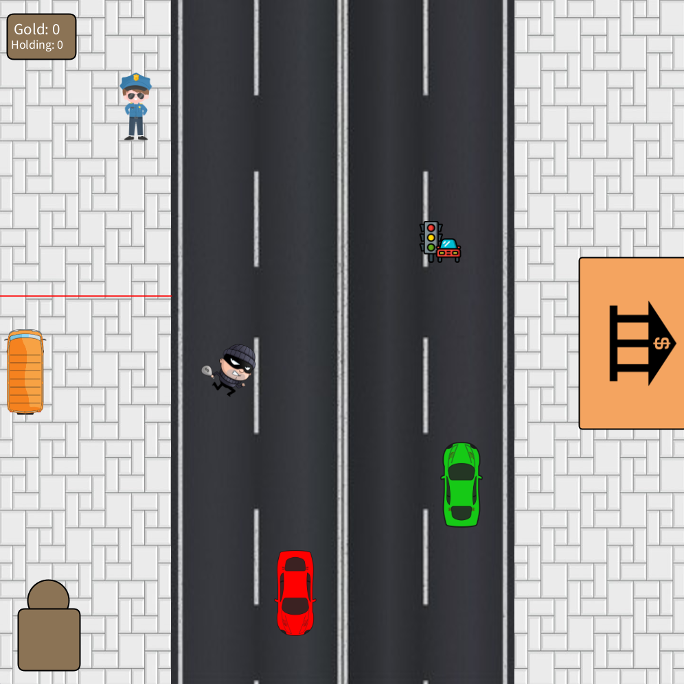

# Golden Thief
## - Game Description
Golden Thief is a simple game, where you will play as the thief and try to get to the bank on the other side of the street and go back to the truck to store it. However, there are some obstacles on the way and also some useful things to make ur run sometimes easier 
___

## - Libraries
[Processing](https://processing.org/)

[Minim](https://code.compartmental.net/minim/)
___

## - Screenshots

### Home Screen

### Tutorial

### During Gameplay

### GameOver

___


## - How To Play
Simply open the folder `GoldenThieve` and then open the `Main.java` file. After that all you have to do is press the green triangle in the top right corner and the rest will be taught to you in the Tutorial
___

## - Model in JShell
1. Open the `GoldenThieve` folder and then open the command prompt by right-clicking somewhere empty and choose `Open in Terminal`. 
2. Once the command prompt is open, type in `jshell.exe --class-path .\out\production\GoldenThieve\`. 
3. After that type in `import GoldenThieve.Model.Model` To import the Model class.\
4. To create a Model Object type in `Model m = new Model(600, 900)`. And with that you can access the Model methods

**Test Example:**
```
PS F:\GoldenThieve> jshell.exe --class-path .\out\production\GoldenThieve\
|  Welcome to JShell -- Version 21.0.1
|  For an introduction type: /help intro

jshell> import GoldenThieve.Model.Model

jshell> Model m = new Model(600, 900)
m ==> GoldenThieve.Model.Model@31dc339b

jshell> m.officerThere()
$3 ==> false

jshell> m.setShowOfficer(true)

jshell> m.officerThere()
$5 ==> true
```
___

